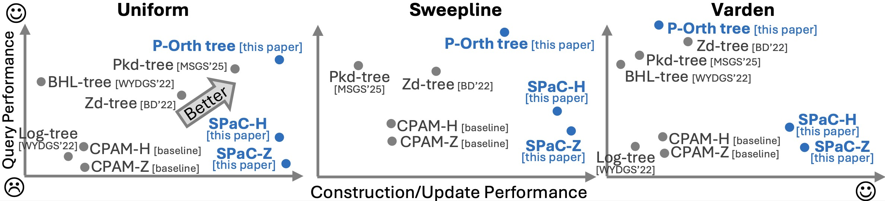

# How to pick the tree?
The answer is all about the operation you need.

Baselines:
- [Pkd-tree](https://dl.acm.org/doi/abs/10.1145/3709712): the SOTA parallel kd-tree;
- [P-Orth tree](https://github.com/ucrparlay/SpaceTreeLib): parallel orth-trees (known as the quad-tree in 2d and oct-tree in 3d);
- [SPaC-H](https://github.com/ucrparlay/SpaceTreeLib): parallel self-balanced 1d-tree using Hilbert code to order points;
- [SPaC-Z](https://github.com/ucrparlay/SpaceTreeLib): similar with SPaC-H but use Morton code instead;
- [CPAM-H/Z](https://dl.acm.org/doi/abs/10.1145/3519939.3523733): another 1d-tree based on the parallel augmented map; 
- [Zd-tree](https://epubs.siam.org/doi/abs/10.1137/1.9781611977042.16): yet another 1d-tree based on the Morton code;
- [BHL-tree](https://dl.acm.org/doi/abs/10.1145/3503221.3508429): a plain parallel kd-tree.
- [Log-tree](https://dl.acm.org/doi/abs/10.1145/3503221.3508429): a parallel kd-tree using logarithmic layout.

Benchmark:
- Uniform: points are uniformly distributed across the cube;
- Sweepline: points are ordered by a certain dimension;
- Varden: points have very skewed distribution.
